+++
title = 'wlan'
date = 2024-03-23T22:16:02+08:00
draft = false
tags = ["network","ap","ac"]
categories = ["Network"]

+++
## wlan组网


### 一、概述

无线局域网(Wireless Local Area Networks； WLAN)利用无线技术在空中传输数据、话音和视频信号。作为传统布线网络的一种替代方案或延伸，无线局域网把个人从办公桌边解放了出来，使他们可以随时随地获取信息，提高了员工的办公效率。
WLAN的优点：它能够方便地联网，因为WLAN可以便捷、迅速地接纳新加入的雇员，而不必对网络的用户管理配置进行过多的变动；WLAN在有线网络布线困难的地方比较容易实施，使用WLAN方案，则不必再实施打孔敷线作业，因而不会对建筑设施造成任何损害。

### 二、802.11基本元素

基本服务器(Basic Service Set)是802.11网络的基本组件，由一组相互通信的工作站所构成。工作站之间的通信在某个模糊地带进行，称为基本服务区域(Basic Service Area)，此区域受限于所使用的无线媒介的传播特性

BSA：BSS的覆盖范围称为基本服务区

BSS分为Independent BSS和Infrastructure BSS两种

独立服务集简称IBSS，工作站之间可以直接通信，但两者间的距离必须在可以通信的范围内。

由于持续时间不长，规模小且目的特殊，IBSS有时称为特设BSS或ad hoc newwork

基础架构模式基本服务集。判断是否为基础结构型网络，只要查看是否有接入点(AP)参与其中

ESS：利用骨干网络将BSS进行连接

SSID：用户的网络名称

BSSID：AP的MAC地址，用来标识AP所管理的BSS


### 三、WLAN拓扑结构

**3.1 Ad-Hoc**

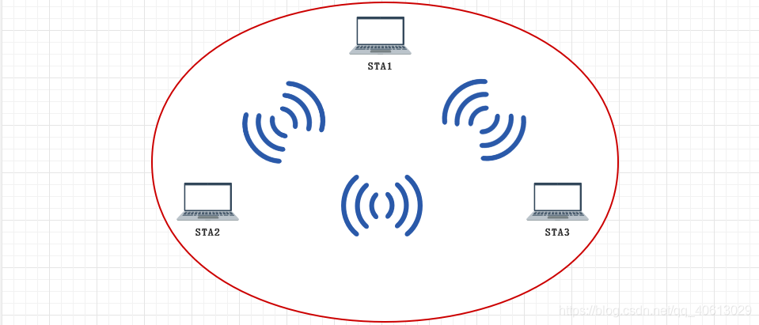

Ad-Hoc拓扑的无线网络由无线工作站组成，用于一台无线工作站和另一台或多台其他无线工作站的直接通讯，该网络无法接入到有线网络中，只能独立使用
**3.2 IBSS**

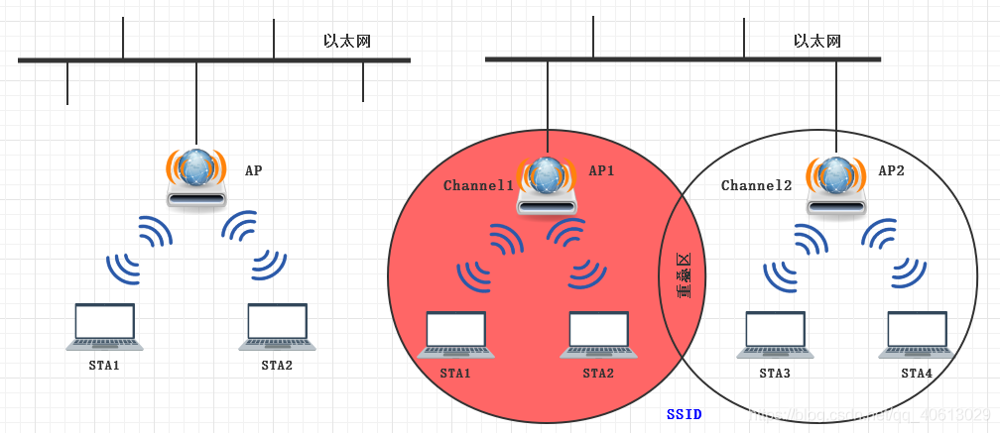

由多个AP以及连接他们的分布式系统(DS)组成的基础架构模式网络，也称为扩展服务区(ESS)。扩展服务区内的每个AP都是一个独立的无线网络基础服务区(BSS)，所有AP共享同一个扩展服务区标识符(ESSID)
相同ESSID的无线网络可以进行漫游，不同ESSID的无线网络形成逻辑子网
AP之间使用互相不重叠的信道，AP之间信号覆盖重叠区域为10%-15%
**3.3 WDS**
WDS(Wireless Distribution System无线分布式系统)：通过无线链路链接两个或者多个独立的有线局域网或者无线局域网，组成一个互通的网络
无线WDS技术提高了整个网络结构的灵活性和便捷性
在WDS部署中，网桥组网模式可分为：
点对点(P2P)
点对多点(P2MP)
中继桥接方式

### 四、AP

**4.1 概述**
无线局域网的架构主要分为
基于控制器的AP架构(瘦AP，FitAP)
传统的独立AP架构(胖AP，FatAP)
近几年WLAN技术的发展，瘦AP正在迅速替代胖AP模式
**4.2 胖AP**
除无线接入功能外，一般具备WLAN、LAN两个接口，多支持DHCP服务器、DNS和MAC地址克隆，以及VPN接入、防火墙等安全功能
胖AP也称为独立AP，所有的配置存储于自治型接入点本身，因此设备的管理和配置均由接入点处理。所有加解密和MAC层功能也由自治型接入点完成
胖AP的例子典型的是无线路由器
**4.3 瘦AP**
无线局域网一体化发展的下一个阶段是集中式WLAN架构。这种模式使用位于网络核心的WLAN控制器，在集中式的无线局域网体系结构中，基于控制器的接入点，也称为轻量型AP

为了实现WLAN网络的快速部署、网络设备的集中管理、精细化的用户管理，相比胖AP方式，企业用户以及运营商更倾向于采用集中控制性WLAN组网(瘦AP+AC)

AC和AP之间采用CAPWAP协议

### 五、CAPWAP简介

CAPWAP(无线接入点控制和配置协议)，用于无线终端接入点(AP)和无线网络控制器(AC)之间的通信和交互，实现AC对其所关联的AP的集中管理和控制
协议内容
AP对AC的自动发现以及AP&AC的状态机运行、维护
AC对AP进行管理、业务配置下发
STA数据封装CAPWAP隧道进行转发

### 六、AP和AC工作过程

**6.1 瘦AP发现AC**

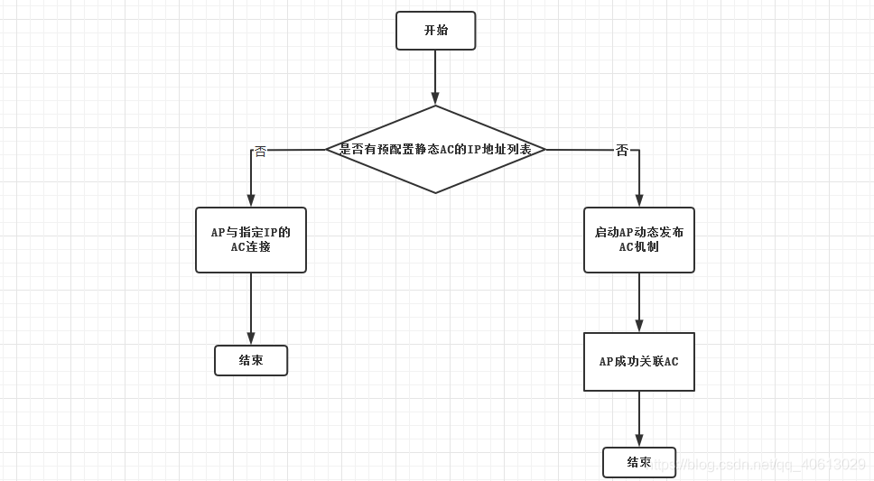

6.2 AP和AC详细工作过程
6.2.1 动态发现

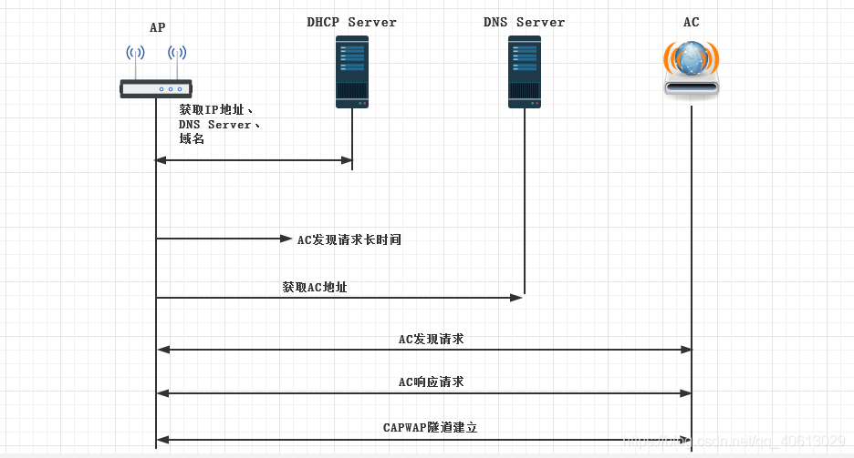

AP启动以后会通过DHCP获取IP地址、DNS Server、域名
AP发出L2广播的发现请求报文试图联系一个AC
如果长时间(30秒)没有响应，AP会启动L3发现。AP会从DHCP Server通过Option43获得AC的IP，或者通过Opthion15获得AC的域名，AP向该IP地址(域名)发送请求
接收到发现请求报文的AC会检查该AP是否接入本机的权限，如果有则回应发现响应
AC和AP间建立CAPWAP隧道
6.2.2 CAPWAP隧道建立过程
DHCP

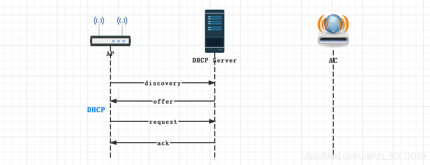

CAPWAP隧道建立-Discover

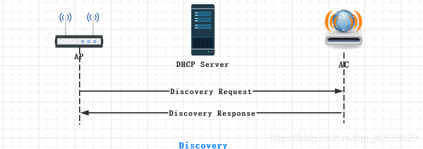

AP使用AP发现机制来获取哪些AC可用，决定与最佳AC建立CAPWAP连接。(当AP上已经静态配置了AC，那么就不需要完成AC的发现过程)
AP启动CAPWAP协议的发现机制，以单播或广播的形式发送请求报文试图关联AC，AC收到AP的discovery Request以后，会发送一个单播的discovery response给AP，AP可以通过discovery response中所带的AC优先级或者AC上当前AP的个数等，确定与哪个AC建立会话
CAPWAP隧道建立-DTLS(可选)

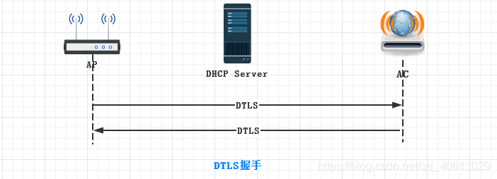

AP根据此IP地址与AC协商，AP接受到响应消息后开始与AC建立CAPWAP隧道，这个阶段可以选择CAPWAP隧道是否采用DTLS加密传输UDP报文
DTLS：Datagram Transport Layer Security(数据报传输层安全协议)
CAPWAP隧道建立-Join

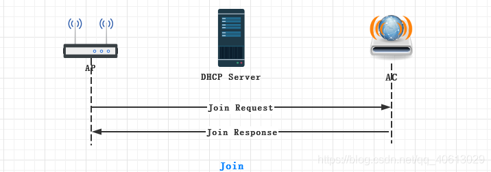

在完成DTLS握手后，AC与AP开始建立控制隧道，在建立控制隧道的交互过程中，AC回应的Join Response报文中会携带用户配置的升级版本号，握手报文间隔/超时时间，控制报文优先级等信息。AC会检查AP的当前版本，如果AP的版本无法与AC要求的相匹配，AP和AC会进入Image Data状态做固件升级，以此来更新AP的版本，如果AP的版本符合要求，则进入Configuration状态
CAPWAP隧道建立-Configure

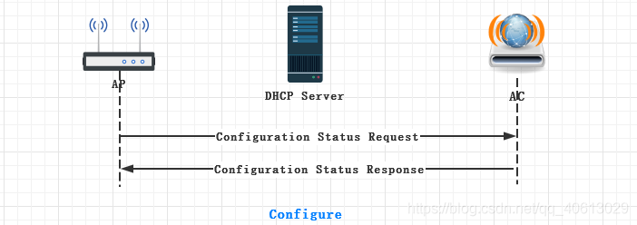

将入Configure状态后为了做AP的现有配置和AC设定配置的匹配检查，AP发送Configuration Request到AC，该信息中包含现有AP的配置，当AP当前配置与AC要求不符时，AC通过Configuration Response通知AP
CAPWAP隧道建立-data check

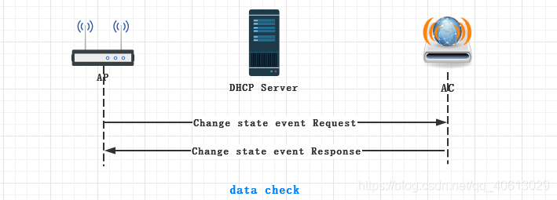

进入run状态，他们之间会发送keeplive报文来维护数据隧道

#### 七、综合实验

7.1 实验组网

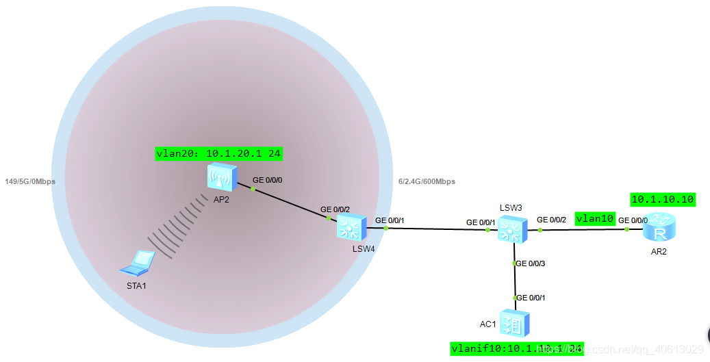

7.2 实验配置

#### 7.2.1 瘦AP配置

1、划分vlan10 20，vlan10用于管理，vlan20用于业务

2、LSW4的配置

```
<Huawei>undo terminal monitor 
<Huawei>sys
[Huawei]vlan batch 10 20 
[Huawei]int g0/0/2
[Huawei-GigabitEthernet0/0/2]port link-type trunk 
[Huawei-GigabitEthernet0/0/2]port trunk allow-pass vlan 10 20
[Huawei-GigabitEthernet0/0/2]port trunk pvid vlan 10
[Huawei-GigabitEthernet0/0/3]int g0/0/1
[Huawei-GigabitEthernet0/0/1]port link-type trunk 
[Huawei-GigabitEthernet0/0/1]port trunk allow-pass vlan 10 20

```

3、LSW3的配置

```
[Huawei]int g0/0/1
[Huawei-GigabitEthernet0/0/1]port link-type trunk 
[Huawei-GigabitEthernet0/0/1]port trunk allow-pass vlan 10 20
[Huawei-GigabitEthernet0/0/1]int g0/0/3
[Huawei-GigabitEthernet0/0/3]port link-type trunk 
[Huawei-GigabitEthernet0/0/3]port trunk allow-pass vlan 10 20

```

4、AC配置

```
[AC6005]vlan batch 10 20
[AC6005-GigabitEthernet0/0/1]port link-type trunk 
[AC6005-GigabitEthernet0/0/1]port trunk allow-pass vlan 10 20
[AC6005-GigabitEthernet0/0/1]q
//配置dhcp
[AC6005]dhcp enable
[AC6005]int Vlanif 10
[AC6005-Vlanif10]ip address 10.1.10.1 24
[AC6005-Vlanif10]dhcp select interface 
[AC6005-Vlanif10]int vlanif 20
[AC6005-Vlanif20]ip address 10.1.20.1 24
[AC6005-Vlanif20]dhcp select interface 
[AC6005-Vlanif20]q
//在AC上配置AP上线
//创建AP组，用于将相同配置的AP加入到同一AP组
[AC6005]wlan
[AC6005-wlan-view]ap-group name ap-group1
[AC6005-wlan-ap-group-ap-group1]q
//创建域管理模板，在域管理模板配置AC的国家码并在AP组下引用管理模块
[AC6005-wlan-view]regulatory-domain-profile name defult
[AC6005-wlan-regulate-domain-defult]country-code cn
[AC6005-wlan-regulate-domain-defult]q
[AC6005-wlan-view]ap-group name ap-group1	
[AC6005-wlan-ap-group-ap-group1]regulatory-domain-profile default
Warning: Modifying the country code will clear channel, power and antenna gain c
onfigurations of the radio and reset the AP. Continue?[Y/N]:y
[AC6005-wlan-ap-group-ap-group1]q
[AC6005-wlan-view]q
//配置AC源接口
[AC6005]capwap source int Vlanif 10
//查看AP2的MAC地址，并记录下来
[AC6005]wlan 
[AC6005-wlan-view]ap auth-mode mac-auth 
[AC6005-wlan-view]ap-id	0 ap-mac [ap2的mac地址]
[AC6005-wlan-ap-0]ap-name area_1
[AC6005-wlan-ap-0]ap-group ap-group1
[AC6005-wlan-ap-0]q
//配置WLAN业务参数，配置WPA-WPA2+PSK+AES
[AC6005]wlan 
[AC6005-wlan-view]security-profile name wlan-net
[AC6005-wlan-sec-prof-wlan-net]security wpa-wpa2 psk pass-phrase 12345678 aes
Warning: The current password is too simple. For the sake of security, you are a
dvised to set a password containing at least two of the following: lowercase let
ters a to z, uppercase letters A to Z, digits, and special characters. Continue?
 [Y/N]:y
[AC6005-wlan-sec-prof-wlan-net]q
//创建名为"wlan-net"的SSID，并配置SSID名称为"wlan-net"
[AC6005-wlan-view]ssid-profile name wlan-net
[AC6005-wlan-ssid-prof-wlan-net]ssid wlan-net
Info: This operation may take a few seconds, please wait.done.
[AC6005-wlan-ssid-prof-wlan-net]q
//创建名为"wlan-net"的VAP模板，配置业务数据转发模式，业务VLAN，并且引用安全模板和SSID
[AC6005-wlan-view]vap-profile name wlan-net
//配置直接转发
[AC6005-wlan-vap-prof-wlan-net]forward-mode direct-forward 
[AC6005-wlan-vap-prof-wlan-net]security-profile wlan-net
Info: This operation may take a few seconds, please wait.done.
[AC6005-wlan-vap-prof-wlan-net]ssid-profile wlan-net
Info: This operation may take a few seconds, please wait.done.
[AC6005-wlan-vap-prof-wlan-net]q
//配置AP组引用VAP模板，AP上射频1和射频1都使用VAP模板"wlan-net"的配置
[AC6005-wlan-view]ap-group name ap-group1
[AC6005-wlan-ap-group-ap-group1]vap-profile wlan-net wlan 1 radio 0
[AC6005-wlan-ap-group-ap-group1]vap-profile wlan-net wlan 1 radio 1
[AC6005-wlan-ap-group-ap-group1]q
//配置AP射频的信道和功率，关闭射频的信道和功率自动调优功能。射频的信道和功率自动调优功能默认开启，如果不关闭此功能则会导致手动配置不生效
[AC6005-wlan-view]rrm-profile name default
[AC6005-wlan-rrm-prof-default]calibrate auto-channel-select disable 
[AC6005-wlan-rrm-prof-default]calibrate auto-txpower-select disable 
[AC6005-wlan-rrm-prof-default]q
//配置射频0的信道和功率
[AC6005-wlan-view]ap-id 0
[AC6005-wlan-ap-0]radio 0
[AC6005-wlan-radio-0/0]channel 20mhz 6
Warning: This action may cause service interruption. Continue?[Y/N]y
[AC6005-wlan-radio-0/0]eirp 127
Info: The EIRP value takes effect only when automatic transmit power selection i
s disabled, and the value depends on the AP specifications and local laws and re
gulations.
[AC6005-wlan-radio-0/0]q
//配置射频1的信道和功率
[AC6005-wlan-ap-0]radio 1
[AC6005-wlan-radio-0/1]channel 20mhz 149
Warning: This action may cause service interruption. Continue?[Y/N]y
[AC6005-wlan-radio-0/1]eirp 127

```

