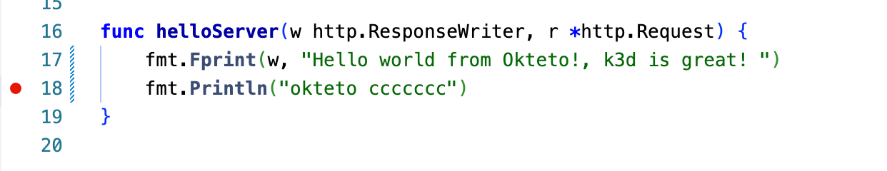
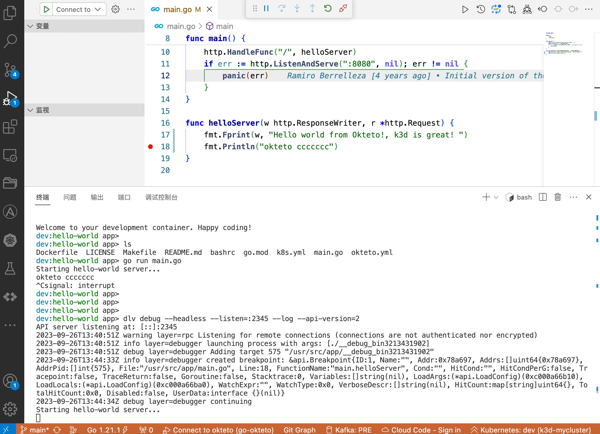
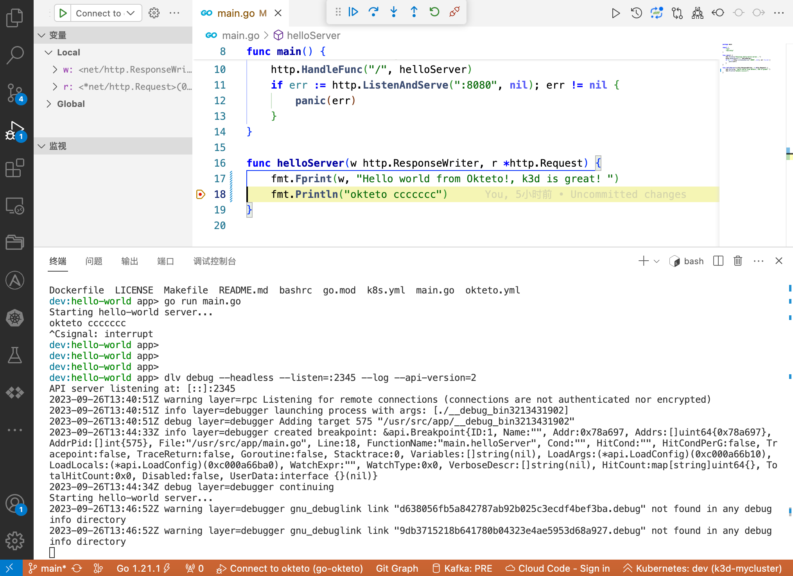

+++
title = 'Okteto'
date = 2023-09-26T19:16:02+08:00
draft = false
tags = ["okteto","kubernetes","vscode","dev"]
categories = ["Kubernetes"]

+++

# Dev in kubernetes

​		传统的开发模式中，是代码存放在本地，使用 IDE 进行编辑和 debug 。但随着容器化火了之后，很多单一服务都进行了拆分，微服务化。在开发阶段，需要本地同时启动多个服务，这使得本地开发调试变得越来越困难。Okteto 是一个通过在 Kubernetes 中来开发和测试代码的应用程序开发工具。可以通过 Okteto 在 Kubernetes 中一键为我们启动一个开发环境，非常简单方便。Google  推出的 Skaffold 只是把 CICD 集成到本地，使用起来也比较困难。Okteto 的工作原理是在 kubernetes 中启动一个服务，把本地代码同步到 pod 中，然后执行命令让服务运行起来，Okteto 可以进行端口的转发，转发pod里服务的端口到本地，在进行 debug 的时候，pod里启动的端口可以被 kubernetes 内的其他服务所访问，本地转发的端口可以被本地的工具（例如 postman ）访问。

* okteto官网文档：https://www.okteto.com/docs
* Go 配置文档：https://www.okteto.com/docs/samples/golang/


示例环境：

* vscode 1.82.1(需要安装 Remote - Kubernetes 插件，插件code：okteto.remote-kubernetes)
* k3d
* mac


## 安装与配置

下载okteto：https://github.com/okteto/okteto/releases

```shell
[crab@Sugar ~]🐳 wget https://ghproxy.com/https://github.com/okteto/okteto/releases/download/2.20.0/okteto-Darwin-arm64

[crab@Sugar ~]🐳 chmod +x okteto-Darwin-arm64
[crab@Sugar ~]🐳 sudo mv okteto-Darwin-arm64 /usr/local/bin/okteto
```


### 下载示例代码

```shell
[crab@Sugar ~]🐳 git clone https://github.com/okteto/go-getting-started go-okteto
[crab@Sugar ~]🐳 cd go-okteto
```

### 配置port-forward端口

需要转发两个，一个是服务的端口，另一个是debug使用的端口

`okteto.yaml`

```yaml
build:
  hello-world:
    image: serialt/go-hello-world:1.0.0
    context: .

deploy:
  - kubectl apply -f k8s.yml

dev:
  hello-world: # 被替换的服务名
    image: okteto/golang:1
    command: bash
    sync:
      - .:/usr/src/app
    volumes:
      - /go
      - /root/.cache
    securityContext:
      capabilities:
        add:
          - SYS_PTRACE
    forward:
      - 2345:2345
      - 8080:8080   # <---- 增加8080服务端口转发

```

设置okteto context，okteto 默认会优先使用`KUBECONFIG`环境变量的配置文件，如果没有设置，则使用 `~/.kube/config`文件

```shell
[crab@Sugar go-okteto]🐳 okteto context
 ✓  Context 'k3d-mycluster' selected
 ✓  Using dev @ k3d-mycluster
```


### 启动服务

```shell
[crab@Sugar go-okteto]🐳 okteto up 
 i  Using dev @ k3d-mycluster as context
 i  'go-getting-started' was already deployed. To redeploy run 'okteto deploy' or 'okteto up --deploy'
 i  Images were already built. To rebuild your images run 'okteto build' or 'okteto deploy --build'
 ✓  Images successfully pulled
 ✓  Files synchronized
    Context:   k3d-mycluster
    Namespace: dev
    Name:      hello-world
    Forward:   2345 -> 2345
               8080 -> 8080

Welcome to your development container. Happy coding!
dev:hello-world app> 
dev:hello-world app> ls
Dockerfile  LICENSE  Makefile  README.md  bashrc  go.mod  k8s.yml  main.go  okteto.yml
```


### 远程开发

```shell
# okteto终端
dev:hello-world app> go run main.go
Starting hello-world server...

# 终端测试
[crab@Sugar ~]🐳 curl 127.0.0.1:8080
Hello world!
```


### 远程调试

```yaml
# okteto终端, 执行dlv命令
dev:hello-world app> dlv debug --headless --listen=:2345 --log --api-version=2
API server listening at: [::]:2345
2023-09-26T13:40:51Z warning layer=rpc Listening for remote connections (connections are not authenticated nor encrypted)
2023-09-26T13:40:51Z info layer=debugger launching process with args: [./__debug_bin3213431902]
2023-09-26T13:40:51Z debug layer=debugger Adding target 575 "/usr/src/app/__debug_bin3213431902"


# main.go 打上debug标记
func helloServer(w http.ResponseWriter, r *http.Request) {
	fmt.Fprint(w, "Hello world from Okteto!, k3d is great! ")
	fmt.Println("okteto ccccccc") # 标记此行
}

```



在vscode debug中点击开始debug



使用命令请求` http://127.0.0.1:8080`，即可debug到标记点

```shell
[sugar@Sugar go-okteto]🐳 curl http://127.0.0.1:8080
Hello world from Okteto!, k3d is great! 
```



