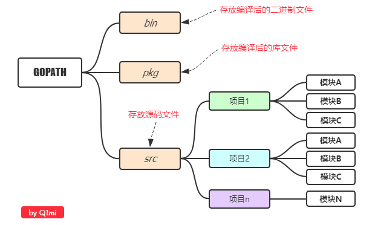
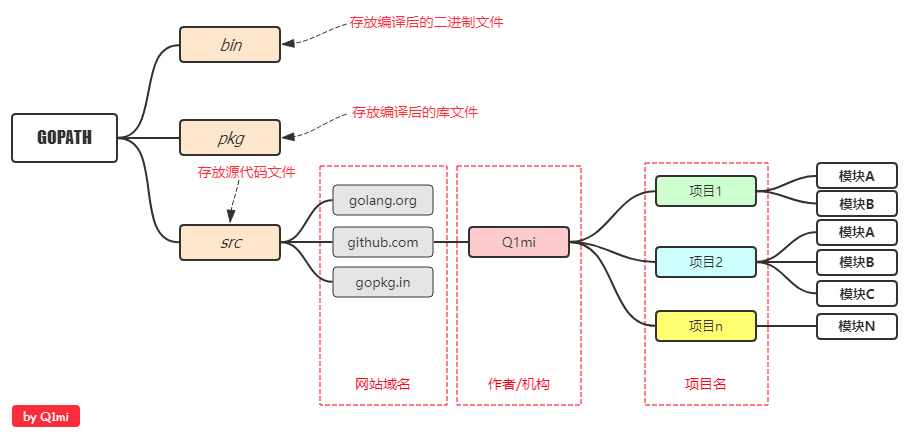
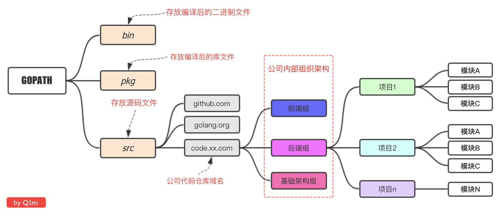

## Go

go开发平台搭建

参考链接：

* ：https://www.cnblogs.com/aaronthon/p/10587487.html

* ：https://www.runoob.com/go/go-environment.html


一、下载地址

Go官网下载地址：https://golang.org/dl/

Go官方镜像站（推荐）：https://golang.google.cn/dl/


Linux下安装

我们在版本选择页面选择并下载好`go1.11.5.linux-amd64.tar.gz`文件：

```
wget https://dl.google.com/go/go1.11.5.linux-amd64.tar.gz
```

将下载好的文件解压到`/usr/local`目录下：

```
mkdir -p /usr/local/go  # 创建目录
tar -C /usr/lcoal/go zxvf go1.11.5.linux-amd64.tar.gz. # 解压
```

如果提示没有权限，加上`sudo`以root用户的身份再运行。执行完就可以在`/usr/local/`下看到go目录了。

配置环境变量： Linux下有两个文件可以配置环境变量，其中`/etc/profile`是对所有用户生效的；`$HOME/.profile`是对当前用户生效的，根据自己的情况自行选择一个文件打开，添加如下两行代码，保存退出。

```
export GOROOT=/usr/local/go
export PATH=$PATH:$GOROOT/bin
```

**Go项目结构**

在进行Go语言开发的时候，我们的代码总是会保存在`$GOPATH/src`目录下。在工程经过`go build`、`go install`或`go get`等指令后，会将下载的第三方包源代码文件放在`$GOPATH/src`目录下， 产生的二进制可执行文件放在 `$GOPATH/bin`目录下，生成的中间缓存文件会被保存在 `$GOPATH/pkg` 下。

如果我们使用版本管理工具（Version Control System，VCS。常用如Git）来管理我们的项目代码时，我们只需要添加`$GOPATH/src`目录的源代码即可。`bin` 和 `pkg` 目录的内容无需版本控制。

**适合个人开发者**

我们知道源代码都是存放在`GOPATH`的`src`目录下，那我们可以按照下图来组织我们的代码。




**目前流行的项目结构**

Go语言中也是通过包来组织代码文件，我们可以引用别人的包也可以发布自己的包，但是为了防止不同包的项目名冲突，我们通常使用`顶级域名`来作为包名的前缀，这样就不担心项目名冲突的问题了。

因为不是每个个人开发者都拥有自己的顶级域名，所以目前流行的方式是使用个人的github用户名来区分不同的包。




举个例子：张三和李四都有一个名叫`studygo`的项目，那么这两个包的路径就会是：

```
import "github.com/zhangsan/studygo"
```

和

```
import "github.com/lisi/studygo"
```

以后我们从github上下载别人包的时候，如：

```
go get github.com/jmoiron/sqlx
```

那么，这个包会下载到我们本地`GOPATH`目录下的`src/github.com/jmoiron/sqlx`。

**适合企业开发者**




二、语法

1、第一个Go程序

```
package main  // 声明 main 包，表明当前是一个可执行程序

import "fmt"  // 导入内置 fmt 包

func main(){  // main函数，是程序执行的入口
    fmt.Println("Hello World!")  // 在终端打印 Hello World!
}

```

运行

```

```


build，当运行go build后，会自动将当前目录下的*.go文件编译

```
go build	
```

在编译过后可以直接执行

go install

`go install`表示安装的意思，它先编译源代码得到可执行文件，然后将可执行文件移动到`GOPATH`的bin目录下。因为我们的环境变量中配置了`GOPATH`下的bin目录，所以我们就可以在任意地方直接执行可执行文件了

**跨平台编译**

默认我们`go build`的可执行文件都是当前操作系统可执行的文件，如果我想在windows下编译一个linux下可执行文件，那需要怎么做呢？

只需要指定目标操作系统的平台和处理器架构即可

```
SET CGO_ENABLED=0 ``// 禁用CGO
SET GOOS=linux ``// 目标平台是linux
SET GOARCH=amd64 ``// 目标处理器架构是amd64
```

然后再执行`go build`命令，得到的就是能够在Linux平台运行的可执行文件了


**Go语言结构**

Go 语言的基础组成有以下几个部分：

- 包声明
- 引入包
- 函数
- 变量
- 语句 & 表达式
- 注释

```
package main

import "fmt"

func main() {
   /* 这是我的第一个简单的程序 */
   fmt.Println("Hello, World!")
}

```

1. 第一行代码 *package main* 定义了包名。你必须在源文件中非注释的第一行指明这个文件属于哪个包，如：package main。package main表示一个可独立执行的程序，每个 Go 应用程序都包含一个名为 main 的包。
2. 下一行 *import "fmt"* 告诉 Go 编译器这个程序需要使用 fmt 包（的函数，或其他元素），fmt 包实现了格式化 IO（输入/输出）的函数。
3. 下一行 *func main()* 是程序开始执行的函数。main 函数是每一个可执行程序所必须包含的，一般来说都是在启动后第一个执行的函数（如果有 init() 函数则会先执行该函数）。
4. 下一行 /*...*/ 是注释，在程序执行时将被忽略。单行注释是最常见的注释形式，你可以在任何地方使用以 // 开头的单行注释。多行注释也叫块注释，均已以 /* 开头，并以 */ 结尾，且不可以嵌套使用，多行注释一般用于包的文档描述或注释成块的代码片段。
5. 下一行 *fmt.Println(...)* 可以将字符串输出到控制台，并在最后自动增加换行字符 \n。
   使用 fmt.Print("hello, world\n") 可以得到相同的结果。
   Print 和 Println 这两个函数也支持使用变量，如：fmt.Println(arr)。如果没有特别指定，它们会以默认的打印格式将变量 arr 输出到控制台。
6. 当标识符（包括常量、变量、类型、函数名、结构字段等等）以一个大写字母开头，如：Group1，那么使用这种形式的标识符的对象就可以被外部包的代码所使用（客户端程序需要先导入这个包），这被称为导出（像面向对象语言中的 public）；标识符如果以小写字母开头，则对包外是不可见的，但是他们在整个包的内部是可见并且可用的（像面向对象语言中的 protected ）。

注意：

需要注意的是 **{** 不能单独放在一行，所以以下代码在运行时会产生错误：

```
package main

import "fmt"

func main()  
{  // 错误，{ 不能在单独的行上
    fmt.Println("Hello, World!")
}
```

go语法：

注释：

以 // 开头的单行注释。多行注释也叫块注释，均已以 /* 开头，并以 */ 结尾。如：

```
// 单行注释
/*
 Author by 菜鸟教程
 我是多行注释
 */
```

字符串连接符号:

Go 语言的字符串可以通过 **+** 实现

```
package main
import "fmt"
func main() {
    fmt.Println("Google" + "Runoob")
}
```

```
# 输出结果
GoogleRunoob
```

关键字

下面列举了 Go 代码中会使用到的 25 个关键字或保留字：

| break    | default     | func   | interface | select |
| -------- | ----------- | ------ | --------- | ------ |
| case     | defer       | go     | map       | struct |
| chan     | else        | goto   | package   | switch |
| const    | fallthrough | if     | range     | type   |
| continue | for         | import | return    | var    |

除了以上介绍的这些关键字，Go 语言还有 36 个预定义标识符：

| append | bool    | byte    | cap     | close  | complex | complex64 | complex128 | uint16  |
| ------ | ------- | ------- | ------- | ------ | ------- | --------- | ---------- | ------- |
| copy   | false   | float32 | float64 | imag   | int     | int8      | int16      | uint32  |
| int32  | int64   | iota    | len     | make   | new     | nil       | panic      | uint64  |
| print  | println | real    | recover | string | true    | uint      | uint8      | uintptr |

程序一般由关键字、常量、变量、运算符、类型和函数组成。

程序中可能会使用到这些分隔符：括号 ()，中括号 [] 和大括号 {}。

程序中可能会使用到这些标点符号：.、,、;、: 和 …。


Go语言数据类型

| 序号 | 类型和描述                                                   |
| :--- | :----------------------------------------------------------- |
| 1    | **布尔型** 布尔型的值只可以是常量 true 或者 false。一个简单的例子：var b bool = true。 |
| 2    | **数字类型** 整型 int 和浮点型 float32、float64，Go 语言支持整型和浮点型数字，并且支持复数，其中位的运算采用补码。 |
| 3    | **字符串类型:** 字符串就是一串固定长度的字符连接起来的字符序列。Go 的字符串是由单个字节连接起来的。Go 语言的字符串的字节使用 UTF-8 编码标识 Unicode 文本。 |
| 4    | **派生类型:** 包括：(a) 指针类型（Pointer）(b) 数组类型(c) 结构化类型(struct)(d) Channel 类型(e) 函数类型(f) 切片类型(g) 接口类型（interface）(h) Map 类型 |

## 数字类型

Go 也有基于架构的类型，例如：int、uint 和 uintptr。

| 序号 | 类型和描述                                                   |
| :--- | :----------------------------------------------------------- |
| 1    | **uint8** 无符号 8 位整型 (0 到 255)                         |
| 2    | **uint16** 无符号 16 位整型 (0 到 65535)                     |
| 3    | **uint32** 无符号 32 位整型 (0 到 4294967295)                |
| 4    | **uint64** 无符号 64 位整型 (0 到 18446744073709551615)      |
| 5    | **int8** 有符号 8 位整型 (-128 到 127)                       |
| 6    | **int16** 有符号 16 位整型 (-32768 到 32767)                 |
| 7    | **int32** 有符号 32 位整型 (-2147483648 到 2147483647)       |
| 8    | **int64** 有符号 64 位整型 (-9223372036854775808 到 9223372036854775807) |

### 浮点型

| 序号 | 类型和描述                        |
| :--- | :-------------------------------- |
| 1    | **float32** IEEE-754 32位浮点型数 |
| 2    | **float64** IEEE-754 64位浮点型数 |
| 3    | **complex64** 32 位实数和虚数     |
| 4    | **complex128** 64 位实数和虚数    |

------

## 其他数字类型

以下列出了其他更多的数字类型：

| 序号 | 类型和描述                               |
| :--- | :--------------------------------------- |
| 1    | **byte** 类似 uint8                      |
| 2    | **rune** 类似 int32                      |
| 3    | **uint** 32 或 64 位                     |
| 4    | **int** 与 uint 一样大小                 |
| 5    | **uintptr** 无符号整型，用于存放一个指针 |

Go语言变量

定义格式

```
var identifier type
```

可以一次声明多个变量

```
var identifier1, identifier2 type
```

```
package main
import "fmt"
func main() {
    var a string = "Runoob"
    fmt.Println(a)

    var b, c int = 1, 2
    fmt.Println(b, c)
}
```

#### 变量声明

**第一种，指定变量类型，如果没有初始化，则变量默认为零值**。

```
var v_name v_type
v_name = value
```

```
package main
import "fmt"
func main() {

    // 声明一个变量并初始化
    var a = "RUNOOB"
    fmt.Println(a)

    // 没有初始化就为零值
    var b int
    fmt.Println(b)

    // bool 零值为 false
    var c bool
    fmt.Println(c)
}
```

```
RUNOOB
0
fals
```

- 数值类型（包括complex64/128）为 **0**

- 布尔类型为 **false**

- 字符串为 **""**（空字符串）

- 以下几种类型为 **nil**：

  ```
  var a *int
  var a []int
  var a map[string] int
  var a chan int
  var a func(string) int
  var a error // error 是接口
  ```

```
package main

import "fmt"

func main() {
    var i int
    var f float64
    var b bool
    var s string
    fmt.Printf("%v %v %v %q\n", i, f, b, s)
}
```

```
0 0 false ""
```

**第二种，根据值自行判定变量类型。**

```
var v_name = value
```

```
package main
import "fmt"
func main() {
    var d = true
    fmt.Println(d)
}
```

```
true
```

**第三种，省略 var, 注意 \**:=\** 左侧如果没有声明新的变量，就产生编译错误，格式**

```
v_name := value
```

```
package main
import "fmt"
func main() {
    f := "Runoob" // var f string = "Runoob"

    fmt.Println(f)
}
```

```
Runoob
```

### 多变量声明

```
//类型相同多个变量, 非全局变量
var vname1, vname2, vname3 type
vname1, vname2, vname3 = v1, v2, v3

var vname1, vname2, vname3 = v1, v2, v3 // 和 python 很像,不需要显示声明类型，自动推断

vname1, vname2, vname3 := v1, v2, v3 // 出现在 := 左侧的变量不应该是已经被声明过的，否则会导致编译错误


// 这种因式分解关键字的写法一般用于声明全局变量
var (
    vname1 v_type1
    vname2 v_type2
)
```

```
package main

var x, y int
var (  // 这种因式分解关键字的写法一般用于声明全局变量
    a int
    b bool
)

var c, d int = 1, 2
var e, f = 123, "hello"

//这种不带声明格式的只能在函数体中出现
//g, h := 123, "hello"

func main(){
    g, h := 123, "hello"
    println(x, y, a, b, c, d, e, f, g, h)
}
```


以上实例执行结果为：

```
0 0 0 false 1 2 123 hello 123 hello
```

简短形式，使用 := 赋值操作符

我们知道可以在变量的初始化时省略变量的类型而由系统自动推断，声明语句写上 var 关键字其实是显得有些多余了，因此我们可以将它们简写为 a := 50 或 b := false。

a 和 b 的类型（int 和 bool）将由编译器自动推断。

这是使用变量的首选形式，但是它只能被用在函数体内，而不可以用于全局变量的声明与赋值。使用操作符 := 可以高效地创建一个新的变量，称之为初始化声明。

**注意事项**

如果在相同的代码块中，我们不可以再次对于相同名称的变量使用初始化声明，例如：a := 20 就是不被允许的，编译器会提示错误 no new variables on left side of :=，但是 a = 20 是可以的，因为这是给相同的变量赋予一个新的值。

如果你在定义变量 a 之前使用它，则会得到编译错误 undefined: a。

如果你声明了一个局部变量却没有在相同的代码块中使用它，同样会得到编译错误

**但是全局变量是允许声明但不使用的**。 同一类型的多个变量可以声明在同一行


Go语言常量

常量是一个简单值的标识符，在程序运行时，不会被修改的量。

常量中的数据类型只可以是布尔型、数字型（整数型、浮点型和复数）和字符串型。

常量的定义格式

```
const identifier [type] = value
```

你可以省略类型说明符 [type]，因为编译器可以根据变量的值来推断其类型。

- 显式类型定义： `const b string = "abc"`
- 隐式类型定义： `const b = "abc"`

多个相同类型的声明可以简写为：

```
const c_name1, c_name2 = value1, value2
```

```
package main

import "fmt"

func main() {
   const LENGTH int = 10
   const WIDTH int = 5  
   var area int
   const a, b, c = 1, false, "str" //多重赋值

   area = LENGTH * WIDTH
   fmt.Printf("面积为 : %d", area)
   println()
   println(a, b, c)  
}

```


Go运算符

```
package main

import "fmt"

func main() {

   var a int = 21
   var b int = 10
   var c int

   c = a + b
   fmt.Printf("第一行 - c 的值为 %d\n", c )
   c = a - b
   fmt.Printf("第二行 - c 的值为 %d\n", c )
   c = a * b
   fmt.Printf("第三行 - c 的值为 %d\n", c )
   c = a / b
   fmt.Printf("第四行 - c 的值为 %d\n", c )
   c = a % b
   fmt.Printf("第五行 - c 的值为 %d\n", c )
   a++
   fmt.Printf("第六行 - a 的值为 %d\n", a )
   a=21   // 为了方便测试，a 这里重新赋值为 21
   a--
   fmt.Printf("第七行 - a 的值为 %d\n", a )
}
```


### 关系运算符

下表列出了所有Go语言的关系运算符。假定 A 值为 10，B 值为 20。

| 运算符 | 描述                                                         | 实例              |
| :----- | :----------------------------------------------------------- | :---------------- |
| ==     | 检查两个值是否相等，如果相等返回 True 否则返回 False。       | (A == B) 为 False |
| !=     | 检查两个值是否不相等，如果不相等返回 True 否则返回 False。   | (A != B) 为 True  |
| >      | 检查左边值是否大于右边值，如果是返回 True 否则返回 False。   | (A > B) 为 False  |
| <      | 检查左边值是否小于右边值，如果是返回 True 否则返回 False。   | (A < B) 为 True   |
| >=     | 检查左边值是否大于等于右边值，如果是返回 True 否则返回 False。 | (A >= B) 为 False |
| <=     | 检查左边值是否小于等于右边值，如果是返回 True 否则返回 False。 | (A <= B) 为 True  |

```
package main

import "fmt"

func main() {
   var a int = 21
   var b int = 10

   if( a == b ) {
      fmt.Printf("第一行 - a 等于 b\n" )
   } else {
      fmt.Printf("第一行 - a 不等于 b\n" )
   }
   if ( a < b ) {
      fmt.Printf("第二行 - a 小于 b\n" )
   } else {
      fmt.Printf("第二行 - a 不小于 b\n" )
   }
   
   if ( a > b ) {
      fmt.Printf("第三行 - a 大于 b\n" )
   } else {
      fmt.Printf("第三行 - a 不大于 b\n" )
   }
   /* Lets change value of a and b */
   a = 5
   b = 20
   if ( a <= b ) {
      fmt.Printf("第四行 - a 小于等于 b\n" )
   }
   if ( b >= a ) {
      fmt.Printf("第五行 - b 大于等于 a\n" )
   }
}
```


### 逻辑运算符

下表列出了所有Go语言的逻辑运算符。假定 A 值为 True，B 值为 False。

| 运算符 | 描述                                                         | 实例               |
| :----- | :----------------------------------------------------------- | :----------------- |
| &&     | 逻辑 AND 运算符。 如果两边的操作数都是 True，则条件 True，否则为 False。 | (A && B) 为 False  |
| \|\|   | 逻辑 OR 运算符。 如果两边的操作数有一个 True，则条件 True，否则为 False。 | (A \|\| B) 为 True |
| !      | 逻辑 NOT 运算符。 如果条件为 True，则逻辑 NOT 条件 False，否则为 True。 | !(A && B) 为 True  |

```
package main

import "fmt"

func main() {
   var a bool = true
   var b bool = false
   if ( a && b ) {
      fmt.Printf("第一行 - 条件为 true\n" )
   }
   if ( a || b ) {
      fmt.Printf("第二行 - 条件为 true\n" )
   }
   /* 修改 a 和 b 的值 */
   a = false
   b = true
   if ( a && b ) {
      fmt.Printf("第三行 - 条件为 true\n" )
   } else {
      fmt.Printf("第三行 - 条件为 false\n" )
   }
   if ( !(a && b) ) {
      fmt.Printf("第四行 - 条件为 true\n" )
   }
}
```

## 赋值运算符

下表列出了所有Go语言的赋值运算符。

| 运算符 | 描述                                           | 实例                                  |
| :----- | :--------------------------------------------- | :------------------------------------ |
| =      | 简单的赋值运算符，将一个表达式的值赋给一个左值 | C = A + B 将 A + B 表达式结果赋值给 C |
| +=     | 相加后再赋值                                   | C += A 等于 C = C + A                 |
| -=     | 相减后再赋值                                   | C -= A 等于 C = C - A                 |
| *=     | 相乘后再赋值                                   | C *= A 等于 C = C * A                 |
| /=     | 相除后再赋值                                   | C /= A 等于 C = C / A                 |
| %=     | 求余后再赋值                                   | C %= A 等于 C = C % A                 |
| <<=    | 左移后赋值                                     | C <<= 2 等于 C = C << 2               |
| >>=    | 右移后赋值                                     | C >>= 2 等于 C = C >> 2               |
| &=     | 按位与后赋值                                   | C &= 2 等于 C = C & 2                 |
| ^=     | 按位异或后赋值                                 | C ^= 2 等于 C = C ^ 2                 |
| \|=    | 按位或后赋值                                   | C \|= 2 等于 C = C \| 2               |

```
package main

import "fmt"

func main() {
   var a int = 21
   var c int

   c =  a
   fmt.Printf("第 1 行 - =  运算符实例，c 值为 = %d\n", c )

   c +=  a
   fmt.Printf("第 2 行 - += 运算符实例，c 值为 = %d\n", c )

   c -=  a
   fmt.Printf("第 3 行 - -= 运算符实例，c 值为 = %d\n", c )

   c *=  a
   fmt.Printf("第 4 行 - *= 运算符实例，c 值为 = %d\n", c )

   c /=  a
   fmt.Printf("第 5 行 - /= 运算符实例，c 值为 = %d\n", c )

   c  = 200;

   c <<=  2
   fmt.Printf("第 6行  - <<= 运算符实例，c 值为 = %d\n", c )

   c >>=  2
   fmt.Printf("第 7 行 - >>= 运算符实例，c 值为 = %d\n", c )

   c &=  2
   fmt.Printf("第 8 行 - &= 运算符实例，c 值为 = %d\n", c )

   c ^=  2
   fmt.Printf("第 9 行 - ^= 运算符实例，c 值为 = %d\n", c )

   c |=  2
   fmt.Printf("第 10 行 - |= 运算符实例，c 值为 = %d\n", c )

}
```

```
第 1 行 - =  运算符实例，c 值为 = 21
第 2 行 - += 运算符实例，c 值为 = 42
第 3 行 - -= 运算符实例，c 值为 = 21
第 4 行 - *= 运算符实例，c 值为 = 441
第 5 行 - /= 运算符实例，c 值为 = 21
第 6行  - <<= 运算符实例，c 值为 = 800
第 7 行 - >>= 运算符实例，c 值为 = 200
第 8 行 - &= 运算符实例，c 值为 = 0
第 9 行 - ^= 运算符实例，c 值为 = 2
第 10 行 - |= 运算符实例，c 值为 = 2
```

## 其他运算符

下表列出了Go语言的其他运算符。

| 运算符 | 描述             | 实例                       |
| :----- | :--------------- | :------------------------- |
| &      | 返回变量存储地址 | &a; 将给出变量的实际地址。 |
| *      | 指针变量。       | *a; 是一个指针变量         |

```
package main

import "fmt"

func main() {
   var a int = 4
   var b int32
   var c float32
   var ptr *int

   /* 运算符实例 */
   fmt.Printf("第 1 行 - a 变量类型为 = %T\n", a );
   fmt.Printf("第 2 行 - b 变量类型为 = %T\n", b );
   fmt.Printf("第 3 行 - c 变量类型为 = %T\n", c );

   /*  & 和 * 运算符实例 */
   ptr = &a     /* 'ptr' 包含了 'a' 变量的地址 */
   fmt.Printf("a 的值为  %d\n", a);
   fmt.Printf("*ptr 为 %d\n", *ptr);
}
```


Go语言条件语句

```
if 布尔表达式 {
   /* 在布尔表达式为 true 时执行 */
}
```

```
package main

import "fmt"

func main() {
   /* 定义局部变量 */
   var a int = 10
 
   /* 使用 if 语句判断布尔表达式 */
   if a < 20 {
       /* 如果条件为 true 则执行以下语句 */
       fmt.Printf("a 小于 20\n" )
   }
   fmt.Printf("a 的值为 : %d\n", a)
}
```


```
if 布尔表达式 {
   /* 在布尔表达式为 true 时执行 */
} else {
  /* 在布尔表达式为 false 时执行 */
}
```

```
package main

import "fmt"

func main() {
   /* 局部变量定义 */
   var a int = 100;
 
   /* 判断布尔表达式 */
   if a < 20 {
       /* 如果条件为 true 则执行以下语句 */
       fmt.Printf("a 小于 20\n" );
   } else {
       /* 如果条件为 false 则执行以下语句 */
       fmt.Printf("a 不小于 20\n" );
   }
   fmt.Printf("a 的值为 : %d\n", a);

}
```

```
switch var1 {
    case val1:
        ...
    case val2:
        ...
    default:
        ...
}
```

```
package main

import "fmt"

func main() {
   /* 定义局部变量 */
   var grade string = "B"
   var marks int = 90

   switch marks {
      case 90: grade = "A"
      case 80: grade = "B"
      case 50,60,70 : grade = "C"
      default: grade = "D"  
   }

   switch {
      case grade == "A" :
         fmt.Printf("优秀!\n" )    
      case grade == "B", grade == "C" :
         fmt.Printf("良好\n" )      
      case grade == "D" :
         fmt.Printf("及格\n" )      
      case grade == "F":
         fmt.Printf("不及格\n" )
      default:
         fmt.Printf("差\n" );
   }
   fmt.Printf("你的等级是 %s\n", grade );      
}
```

switch 默认情况下 case 最后自带 break 语句，匹配成功后就不会执行其他 case，如果我们需要执行后面的 case，可以使用 **fallthrough** ,使用 fallthrough 会强制执行后面的 case 语句，fallthrough 不会判断下一条 case 的表达式结果是否为 true

```
package main

import "fmt"

func main() {

    switch {
    case false:
            fmt.Println("1、case 条件语句为 false")
            fallthrough
    case true:
            fmt.Println("2、case 条件语句为 true")
            fallthrough
    case false:
            fmt.Println("3、case 条件语句为 false")
            fallthrough
    case true:
            fmt.Println("4、case 条件语句为 true")
    case false:
            fmt.Println("5、case 条件语句为 false")
            fallthrough
    default:
            fmt.Println("6、默认 case")
    }
}
```


